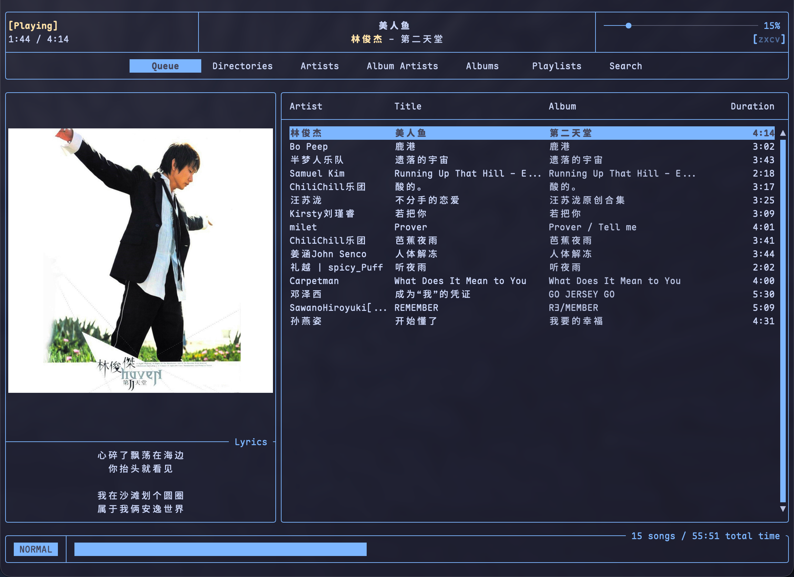

# net-mpd

[](https://github.com/4fuu/net-mpd/actions/workflows/ci.yml)
[](https://github.com/4fuu/net-mpd/releases/latest)

**net-mpd** is an [MPD](https://www.musicpd.org/) 0.23.5-compatible server that
exposes a [NetEase Cloud Music](https://music.163.com/) account to
**[rmpc](https://github.com/mierak/rmpc)**.

Browse playlists, play queue tracks, show lyrics and cover art, and control
playback from rmpc — without keeping the official client open. Login, cookies,
stream URL resolution, and native audio playback are all handled in-process.

<p align="center">
  
</p>

<p align="center"><sub>rmpc Queue view against net-mpd: now playing, cover, lyrics, and library tabs.</sub></p>

> Other MPD clients may work for basic playback. rmpc is the intended front-end
> and is what net-mpd is tested against.

## Features

net-mpd covers **most day-to-day NetEase Cloud Music usage** through MPD
playlists and rmpc:

| Area | What you get |
|------|----------------|
| **Library** | User playlists, liked songs, cloud disk, recent plays |
| **Discover** | Daily song recommendations, **Private FM (私人FM)**, intelligence / 心动 mode seeded from liked songs |
| **Browse** | Artist / album tag views, cloud search |
| **Playback** | Play / pause / seek / next / previous, volume, repeat / random / single / consume |
| **Queue** | Add, load playlist, delete, move, swap, shuffle, command lists |
| **Metadata** | Cover art (`albumart` / `readpicture`), NetEase LRC lyrics for rmpc (bilingual `original / translation` when `tlyric` exists) |
| **Editing** | Create / rename / delete playlists; add or remove tracks (virtual modes are read-only) |
| **System** | macOS Now Playing / Control Center / headset keys; local song stickers; optional MPD password |
| **Engine** | Built-in native audio (no ffplay): AVPlayer (macOS), MediaPlayer (Windows), Beep/Oto (Linux) |

Special NetEase modes appear as playlists (liked → 心动 → 私人FM → 每日推荐 →
最近播放 → 云盘, then your other lists). Names are prefixed with `01 -`, `02 -`,
… so rmpc’s alphabetical sort keeps server order. Bare names and short aliases
(`personal_fm`, `intelligence`, …) still work for `load` / `update`.

Songs use stable URIs: `netease://song/<id>`. Playback URLs are resolved only
when a track starts.

## Requirements

- **[rmpc](https://github.com/mierak/rmpc)** as the MPD client
- A NetEase Cloud Music account (QR login from the terminal)
- **From source:** Go 1.26+
- **Linux audio:** PulseAudio-compatible server, or `libasound.so.2` (ALSA)

No external player binary is required.

## Install

### Homebrew (macOS / Linux)

```bash
brew tap 4fuu/net-mpd https://github.com/4fuu/net-mpd
brew install 4fuu/net-mpd/net-mpd
```

```bash
net-mpd login
brew services start net-mpd   # optional: run at login
```

### GitHub Releases

Download the archive for your platform from
[Releases](https://github.com/4fuu/net-mpd/releases/latest).

### Build from source

```bash
git clone https://github.com/4fuu/net-mpd.git
cd net-mpd
go build -o net-mpd ./cmd/net-mpd
```

## Quick start

```bash
# 1. Log in (scan the QR code with the NetEase mobile app)
./net-mpd login

# 2. Start the server (default 127.0.0.1:6600)
./net-mpd

# 3. Point rmpc at it (~/.config/rmpc/config.ron)
```

```ron
(
    address: "127.0.0.1:6600",
    // macOS example — use your lyrics cache path from the log line at startup
    lyrics_dir: Some("/Users/YOU/Library/Application Support/net-mpd/lyrics"),
    enable_lyrics_index: true,
    enable_lyrics_hot_reload: true,
)
```

Then run `rmpc`.

### Useful flags

```bash
./net-mpd -listen 127.0.0.1:16600 \
  -cookie /path/to/cookie \
  -password "secret" \
  -lyrics /path/to/lyrics \
  -stickers /path/to/stickers.json
```

| Flag / env | Default | Meaning |
|------------|---------|---------|
| `-listen` | `127.0.0.1:6600` | Bind address |
| `-password` / `NET_MPD_PASSWORD` | empty = no auth | MPD password |
| `-cookie` | under app data dir | Cookie jar path |
| `-lyrics` | beside cookie | LRC cache for rmpc |
| `-stickers` | beside cookie | Sticker store |
| `-pause-timeout` | `2m` | Release the audio backend when paused with no clients for this long (`0` disables; resume continues from the same position) |
| `NET_MPD_HOME` | platform config dir | App data root |

## Authentication

```bash
./net-mpd login          # QR login
./net-mpd status         # current session
./net-mpd refresh        # refresh / persist session
./net-mpd cookie-path    # print jar location
./net-mpd logout         # revoke remote session + delete local jar
./net-mpd import-cookie /path/to/existing/cookie   # optional one-shot import
```

Default cookie locations:

| OS | Path |
|----|------|
| macOS | `~/Library/Application Support/net-mpd/cookie` |
| Linux | `$XDG_CONFIG_HOME/net-mpd/cookie` or `~/.config/net-mpd/cookie` |
| Windows | `%AppData%\net-mpd\cookie` |

Jars are created with owner-only permissions where the OS allows. Cookie values
and temporary playback URLs are never logged.

## Playlists & NetEase modes

| Display name (after index prefix) | Aliases | Source |
|-----------------------------------|---------|--------|
| `{liked}` | first user playlist | 我喜欢的音乐 |
| `{liked}（心动模式）` | `intelligence`, `心动模式` | Intelligence mode from liked |
| `私人FM` | `personal_fm` | Private FM |
| `每日推荐` | `daily_recommend`, `daily_songs` | Daily recommendations |
| `最近播放` | `recent_songs`, `recent` | Recently played |
| `云盘` | `cloud` | Cloud disk |

Virtual modes are **read-only** (`rm` / `rename` / `playlistadd` / … rejected).

```bash
# Refresh one list (e.g. new FM batch)
# In rmpc: Update on that playlist, or via any MPD client:
#   update "03 - 私人FM"
# Full library update skips unchanged trackCounts and drops virtual caches.
```

Slash characters in NetEase titles (e.g. `25/05`) are shown as fullwidth `／`
so clients do not treat them as path separators.

## Lyrics

On each play, net-mpd writes NetEase LRC into the lyrics cache (see startup log
or `-lyrics`). Point rmpc’s `lyrics_dir` there (example in [Quick start](#quick-start)).
Restart rmpc or change tracks once after the first play so the Lyrics pane
picks up the file.

When NetEase provides a translation (`tlyric`), lines are merged for rmpc as
`original / translation` on the same timestamp. Songs without an official
translation stay original-only (typical for Chinese tracks).

### Cache limits

| Cache | Policy |
|-------|--------|
| Lyrics (disk) | Up to **1000** `.lrc` files or **50 MiB**, whichever bites first; oldest by mtime are pruned. Playing a cached track refreshes its mtime. Format upgrades rewrite stale files automatically. |
| Cover art (memory) | **32** images, LRU |
| Library / playlists (memory) | Kept for browsing; refreshed via MPD `update` |

Delete the lyrics directory anytime to force a full re-fetch.

## Configuration tips (rmpc)

Minimal `config.ron`:

```ron
(
    address: "127.0.0.1:6600",
    // password: Some("secret"),   // if -password / NET_MPD_PASSWORD is set
    lyrics_dir: Some("/path/to/net-mpd/lyrics"),
    enable_lyrics_index: true,
    enable_lyrics_hot_reload: true,
)
```

Use the **Playlists** tab for ordered NetEase lists (including 私人FM and 每日推荐).
The **Queue** tab shows the current play queue, cover, and lyrics (see screenshot above).

## Performance notes

Library loading is tuned to reduce NetEase API traffic:

- Reuse embedded tracks from playlist detail (skip bulk `song/detail` when possible)
- Share already-resolved song metadata across playlists
- Coalesce concurrent loads of the same playlist
- Scoped `update "name"` reloads only that list
- Full `update` skips playlists whose `trackCount` is unchanged
- Playlist edits patch the local cache instead of reloading everything

The first tag browser query after a cold start may still wait while the cache
warms; a background warm-up runs at startup.

## Development

```bash
go test ./...

# Optional live test with an existing Musicfox cookie
export MUSICFOX_COOKIE_FILE=/path/to/go-musicfox/data/cookie
go test -run TestMusicfoxSession -v ./internal/ncm
```

## Roadmap

Not a commitment to order or schedule:

- [ ] Windows SMTC (taskbar / media keys), similar to go-musicfox
- [ ] Stored-playlist track reordering (`playlistmove`, …)
- [ ] Broader MPD client coverage beyond rmpc’s daily paths
- [ ] Faster cold start for large libraries
- [ ] More playback URL / CDN fallbacks
- [ ] Optional rmpcd integration notes

## Acknowledgements

Built on [go-musicfox](https://github.com/go-musicfox/go-musicfox) and the
[netease-music](https://github.com/go-musicfox/netease-music) SDK. Playback
backends, session handling, and macOS media-control patterns draw heavily from
musicfox. Thanks to the authors and contributors.

## License

- Original net-mpd source: [MIT](LICENSE)
- Release binaries link GPL-3.0 UnblockNeteaseMusic code via the go-musicfox SDK,
  so **combined binaries are GPL-3.0**. Releases ship licenses, third-party
  notices, and Corresponding Source — see [THIRD_PARTY_NOTICES.md](THIRD_PARTY_NOTICES.md).
